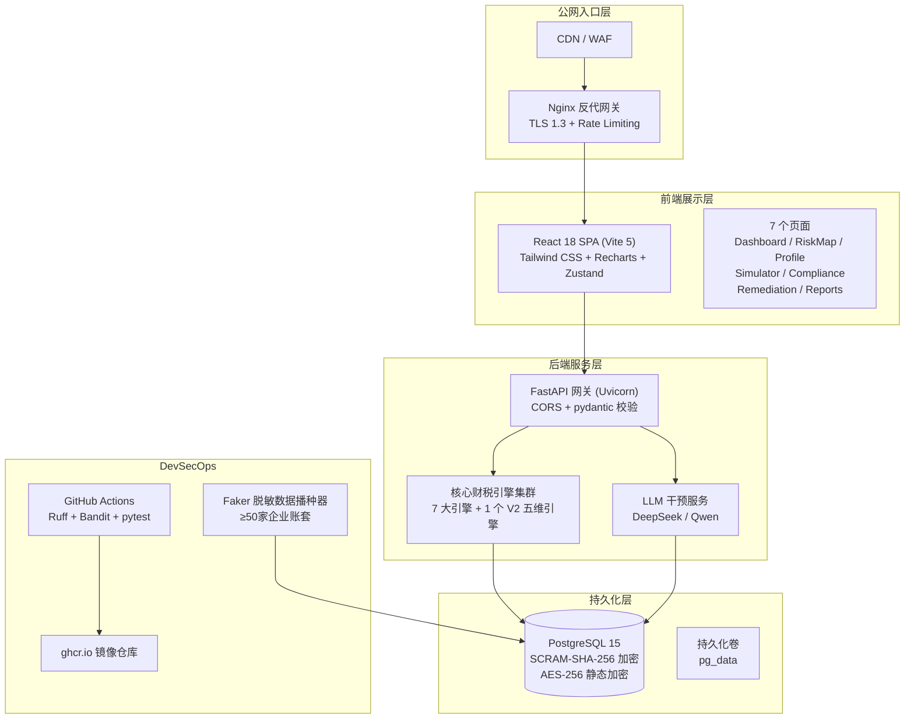
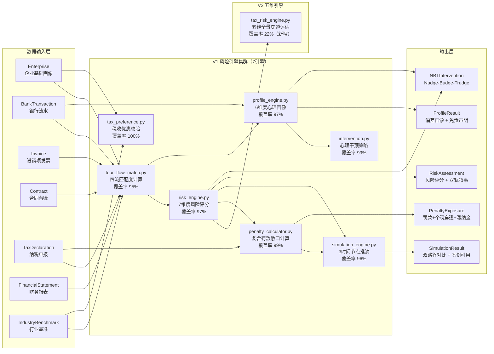
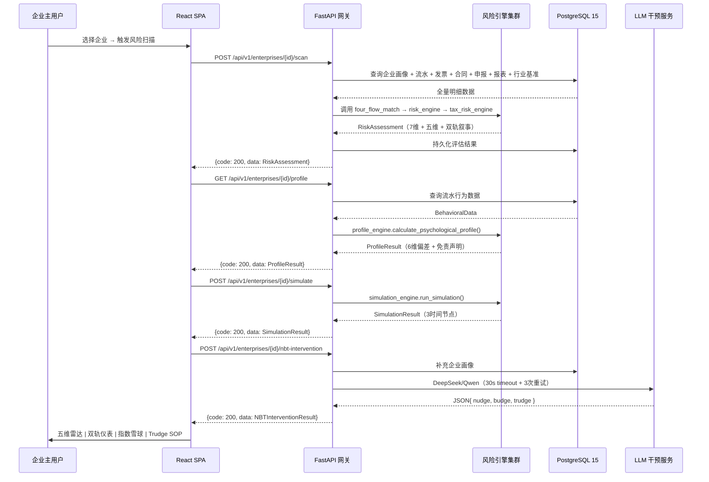
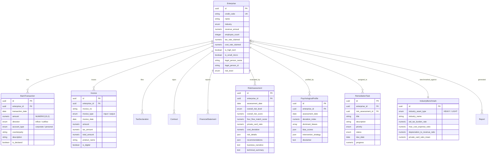
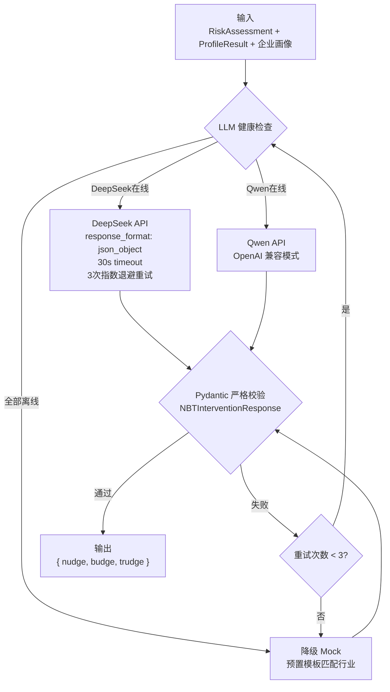
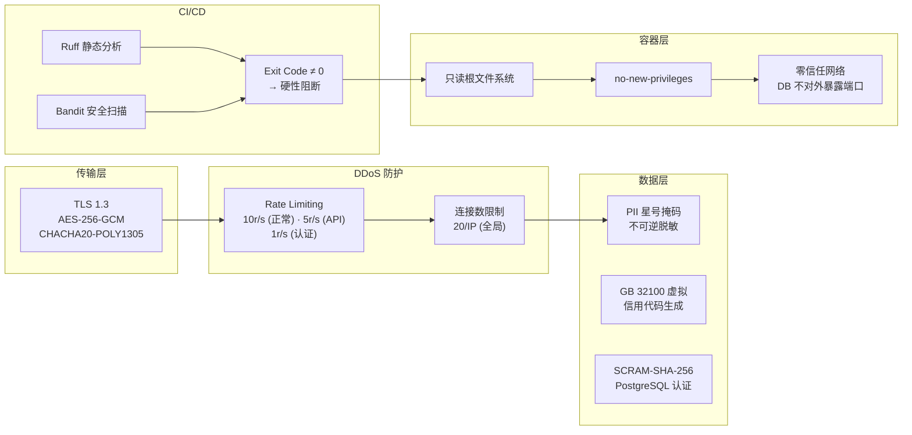
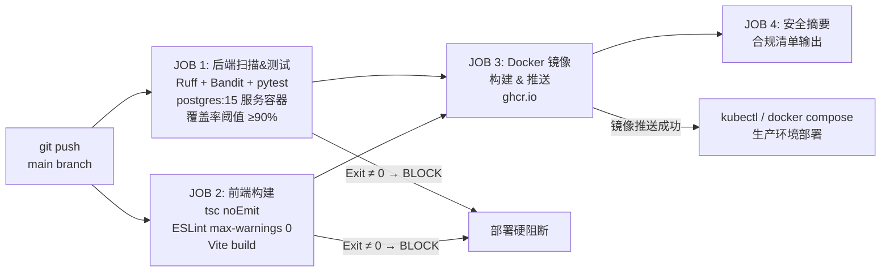

# 「税智·心判」多维业态财税合规与内控决策支持系统 架构设计文档

> 版本：v1.0 | 日期：2026-07-14 | 安全等级：等保 2.0 三级

---

## 目录

1. [系统全景拓扑](#1-系统全景拓扑)
2. [核心引擎架构](#2-核心引擎架构)
3. [数据流设计](#3-数据流设计)
4. [前端组件树](#4-前端组件树)
5. [数据库 E-R 图](#5-数据库-e-r-图)
6. [API 端点表](#6-api-端点表)
7. [NBT 行为干预管线](#7-nbt-行为干预管线)
8. [安全架构](#8-安全架构)
9. [技术栈](#9-技术栈)
10. [DevSecOps 部署流水线](#10-devsecops-部署流水线)

---

## 1. 系统全景拓扑



---

## 2. 核心引擎架构

系统核心由**8个纯函数/纯硬编码财税引擎**组成，所有数值运算强制使用 `decimal.Decimal`，严禁浮点数，严禁大模型参与数值推演。



### 2.1 五维全景穿透评估引擎（V2）

`calculate_comprehensive_tax_risk()` — 计划书 V2 优化版核心交付物：

| 维度 | 评估内容 | 阻断逻辑 | 法律依据 |
|------|---------|---------|---------|
| **一** | 行业基准与宏观内控核算（成本费用率） | `actual_cost_rate > benchmark × 1.5` → `InternalControlFailureWarning` | 行业财税特征量化 |
| **二** | 增值税GAAR穿透（四流匹配 + 资金闭环） | `four_flow_score < 60 AND fund_loopback_detected` → `GAARViolationWarning` | 《企业所得税法》第47条 |
| **三** | 个人所得税隐性分红穿透 | `shareholder_loan > 0 AND days_overdue > 365` → 强制 ×20% | 财税[2003]158号 |
| **四** | 0.5-5.0×浮动行政罚款 + 日万分之五复利滞纳金 | 多级倍数叠加 | 《税收征收管理法》第32/63/68条 |
| **五** | 综合加权评分 + 一票否决 | 「三流及以上维度命中高危阈值」→ 总体风险 = CRITICAL | 风险矩阵评估框架 |

---

## 3. 数据流设计



---

## 4. 前端组件树

```
App.tsx (Vite 5 + React 18 + TypeScript)
│
├── MainLayout
│   ├── Header                      # 企业选择器 + 导航栏
│   └── Sidebar                     # 7个页面入口
│
├── Dashboard.tsx                   # 数据驾驶舱
│   ├── StatCard × 4                # 核心KPI卡片
│   ├── RiskRadar                   # 7维度雷达图
│   ├── RiskBarChart                # 风险维度柱状图
│   └── RiskTrendChart              # 风险评分趋势折线图
│
├── RiskMap.tsx                     # 五维全景税务内控侦测面板（重构版）
│   ├── BusinessModelBanner         # 重资产/轻资产锚点标识
│   ├── RiskLegend                  # 风险三色图例
│   ├── LanguageToggle              # 商业/技术视角切换
│   ├── ICRadarSection              # 宏观内控雷达监测区
│   │   ├── DualCostGauge           #   成本费用率 vs 行业警戒阈值（SVG弧线）
│   │   └── TaxBurdenElasticityChart #  收入增长率 vs 税负率下跌曲线
│   ├── RiskMapCard × 7            # 7维度可展开卡片
│   ├── NudgeLayerBanner            # Nudge高压渲染（#EF4444背景）
│   └── BridgeLayerPanel            # 损失框架对比（高压时显示）
│
├── Profile.tsx                     # 心理画像仪
│   ├── ProfileRadarChart           # 6维度偏差雷达图
│   ├── BiasCard                    # 主导偏差卡片
│   ├── ProfileSummary              # 画像摘要
│   └── DisclaimerBanner            # 免责声明
│
├── Simulator.tsx                   # 沉浸式风险模拟器（重构版）
│   ├── SimulationInputForm         # 参数输入面板
│   ├── ExponentialSnowballChart    # 指数雪球双路径对比图
│   ├── SnowballDecompositionTable  # 组分分解表（本金+罚金+个税+滞纳金）
│   ├── LossFrameMessage            # 损失框架话术
│   ├── CaseStudyCard               # 同行业案例引用
│   ├── TrudgeChecklist             # 可交互SOP微任务打卡列表
│   │   ├── ProgressBar             #   合规整改进度条
│   │   └── TrudgeTaskItem × N      #   可展开详情 + 勾选框
│   └── RecommendationBanner        # 模拟建议
│
├── Compliance.tsx                  # 合规导航仪
│   ├── TaxPreferencePanel          # 税收优惠校验面板
│   ├── PlanComparisonTable         # 方案对比表
│   └── InterventionLayerCard       # 干预策略卡片
│
├── Remediation.tsx                 # 整改追踪器
│   ├── ProgressDonut               # 进度环形图
│   ├── TaskCard × N                # 任务卡片列表
│   └── ImprovementFeedback         # 整改反馈面板
│
├── Reports.tsx                     # 报告查看页
│
└── Common Components               # 通用组件
    ├── LoadingSpinner
    ├── EmptyState
    ├── RiskBadge
    └── Disclaimer
```

**状态管理（Zustand Store）：**

```
store/index.ts
├── useEnterpriseStore              # { currentEnterprise, enterprises[], selectEnterprise() }
├── useRiskStore                    # { result, loading, scanRisk() }
└── useRemediationStore             # { tasks[], fetchTasks() }
```

---

## 5. 数据库 E-R 图



### 数值精度红线

所有货币/比率字段强制使用 PostgreSQL NUMERIC 类型：

| 字段类型 | PostgreSQL 列定义 | Python 端 |
|---------|-------------------|----------|
| 金额 | `NUMERIC(15,2)` | `Decimal(str(value)).quantize(Decimal("0.01"))` |
| 比率 | `NUMERIC(10,4)` | `Decimal(str(value)).quantize(Decimal("0.0001"))` |
| 百分比 | `NUMERIC(5,2)` | `Decimal(str(value))` |
| 日期 | `DATE` / `TIMESTAMP WITH TIME ZONE` | `date.today()` / `datetime.now(tz=...)` |

---

## 6. API 端点表

基础路径：`/api/v1`

### 企业管理

| 方法 | 路径 | 说明 | 状态 |
|------|------|------|------|
| `GET` | `/enterprises` | 企业列表（分页） | ✅ |
| `GET` | `/enterprises/{id}` | 企业详情 | ✅ |
| `POST` | `/enterprises` | 新增企业 | ✅ |

### 数据导入

| 方法 | 路径 | 说明 | 状态 |
|------|------|------|------|
| `POST` | `/enterprises/{id}/bank-transactions` | 导入银行流水 | ✅ |
| `POST` | `/enterprises/{id}/invoices` | 导入发票 | ✅ |
| `POST` | `/enterprises/{id}/tax-declarations` | 导入纳税申报 | ✅ |
| `POST` | `/enterprises/{id}/contracts` | 导入合同 | ✅ |

### 风险引擎

| 方法 | 路径 | 说明 | 状态 |
|------|------|------|------|
| `POST` | `/enterprises/{id}/scan` | 执行风险扫描（V1+V2 引擎） | ✅ |
| `GET` | `/enterprises/{id}/risk-assessments` | 风险评估历史 | ✅ |
| `GET` | `/enterprises/{id}/profile` | 心理画像 | ✅ |

### 风险模拟

| 方法 | 路径 | 说明 | 状态 |
|------|------|------|------|
| `POST` | `/enterprises/{id}/simulate` | 执行风险模拟（3时间节点） | ✅ |
| `GET` | `/enterprises/{id}/simulation-history` | 模拟历史 | ✅ |

### 合规导航

| 方法 | 路径 | 说明 | 状态 |
|------|------|------|------|
| `GET` | `/enterprises/{id}/tax-preference` | 税收优惠校验 | ✅ |
| `GET` | `/enterprises/{id}/intervention` | 干预策略 | ✅ |
| `POST` | `/enterprises/{id}/nbt-intervention` | **NBT 三层行为干预（LLM）** | ✅ |

### 整改追踪

| 方法 | 路径 | 说明 | 状态 |
|------|------|------|------|
| `GET` | `/enterprises/{id}/tasks` | 整改任务列表 | ✅ |
| `POST` | `/enterprises/{id}/tasks` | 创建整改任务 | ✅ |
| `PUT` | `/tasks/{id}` | 更新任务状态 | ✅ |

### 报告

| 方法 | 路径 | 说明 | 状态 |
|------|------|------|------|
| `POST` | `/enterprises/{id}/reports` | 生成综合风险报告 | ✅ |
| `GET` | `/enterprises/{id}/reports` | 报告列表 | ✅ |

### AI 助手

| 方法 | 路径 | 说明 | 状态 |
|------|------|------|------|
| `POST` | `/enterprises/{id}/ai-assistant` | AI 智能纳税合规顾问 | ✅ |
| `GET` | `/enterprises/{id}/case-studies` | 同行业案例库 | ✅ |

### 健康检查

| 方法 | 路径 | 说明 | 状态 |
|------|------|------|------|
| `GET` | `/health` | 健康检查 | ✅ |

### 统一响应格式

```json
{
  "code": 200,
  "message": "操作成功",
  "data": { ... }
}
```

**错误码体系：**

| 错误码 | 含义 |
|--------|------|
| `200` | 成功 |
| `40001` | 参数校验失败 |
| `40002` | 业务逻辑错误 |
| `40003` | 资源不存在 |
| `50000` | 服务器内部错误 |

---

## 7. NBT 行为干预管线



**三层结构说明：**

| 层 | 名称 | 心理学基础 | 前端渲染 |
|----|------|-----------|---------|
| **Nudge** | 环境助推 | 注意力引导 + 色彩心理学 | #EF4444 深红高压渲染 + 直白预警文案 |
| **Bridge** | 信念重塑 | 前景理论（损失敏感度 ≈ 收益 ×2.5） | 三卡片面板（损失对比/破除逃避/时间压力） |
| **Trudge** | 长效信任 | 自我效能感 + 承诺一致性 | 交互式 Checkbox 微任务列表 + 进度条 |

---

## 8. 安全架构



### 安全头注入（Nginx）

| Header | 值 | 目的 |
|--------|---|------|
| `Strict-Transport-Security` | `max-age=63072000; includeSubDomains; preload` | 强制 HTTPS |
| `X-Content-Type-Options` | `nosniff` | 防 MIME 嗅探 |
| `X-Frame-Options` | `DENY` | 防 Clickjacking |
| `X-XSS-Protection` | `1; mode=block` | 防 XSS |
| `Referrer-Policy` | `strict-origin-when-cross-origin` | 隐私保护 |
| `Content-Security-Policy` | `default-src 'self'` | XSS 纵深防御 |

---

## 9. 技术栈

| 层级 | 技术选型 | 版本 |
|------|---------|------|
| **前端框架** | React + TypeScript | 18.x |
| **构建工具** | Vite | 5.x |
| **CSS 框架** | Tailwind CSS | 3.4 |
| **图表库** | Recharts | 2.x |
| **状态管理** | Zustand | 5.x |
| **HTTP 客户端** | Axios | 1.x |
| **UI 组件** | Ant Design | 5.x |
| **后端框架** | FastAPI + Uvicorn | 0.x |
| **ORM** | SQLAlchemy 2.0 (async) | 2.x |
| **数据校验** | Pydantic v2 | 2.x |
| **数据库** | PostgreSQL (asyncpg) | 15 |
| **迁移工具** | Alembic | 1.x |
| **数值计算** | decimal.Decimal | 内置 |
| **数据播种** | Python Faker | >=30.0 |
| **LLM 集成** | httpx + openai SDK | — |
| **CI/CD** | GitHub Actions | v4 |
| **容器化** | Docker + Docker Compose | — |
| **Web 服务器** | Nginx | 1.x |
| **静态分析** | Ruff + Bandit | — |
| **测试框架** | pytest + pytest-asyncio + pytest-cov | — |

---

## 10. DevSecOps 部署流水线



### 部署检查清单

```yaml
# 部署前执行
docker compose up -d postgres
cd backend && alembic upgrade head
python ../scripts/mock_desensitized_data_seeder.py --count 50
docker compose up -d --build

# 验证端点
curl -k https://localhost/api/v1/health
curl -k https://localhost/api/v1/enterprises

# 运行测试
cd backend && pytest tests/ --cov=app/core --cov-fail-under=90
```

---

*文档生成时间：2026-07-14*
*本文档与 `api.md`、`deployment.md`、`ai_collaboration_log.md` 共同构成项目技术文档体系。*
